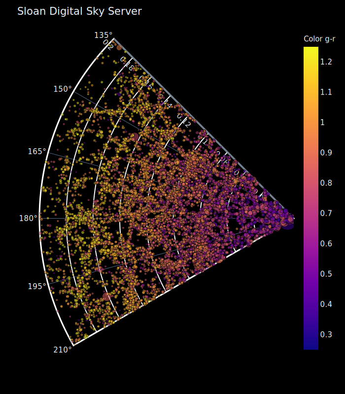

#Mapeando el Universo

Repositorio para la mentoria - DiploDatos 2020

## Objetivo general

- Determinar el corrimiento al rojo (*redshift*)

## Algunos objetivos específicos

## Base de datos

La base de datos es una porción del 
